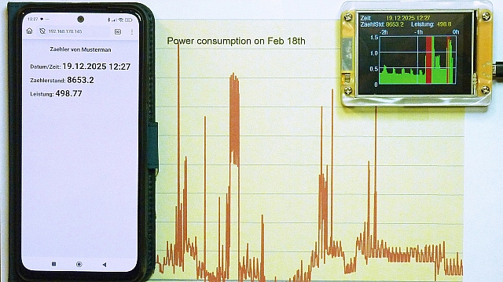

Maker Media GmbH

***

# Balkonsolar optimieren

Das Balkonkraftwerk ist installiert und produziert fleißig. Um den Strom möglichst gut zu nutzen und dem Versorger nichts zu schenken, müssen aber die Verbräuche sowie Grund- und Spitzenlasten bekannt sein. Diese Daten liefert der hier vorgestellte ESP32 basierte Energiemonitor ohne Eingriffe in die Elektrik übersichtlich über sein Display, eine Website und downloadbaren Datenreihen. 

 

Im Ordner `src` finden sie den Arduino Code für den Sender und Empfänger. Hier gibt es auch eine Readme.md in dem nochmal eine kurze Funktionsbeschreibung und Liste der nötigen Bibliotheken steht.

Den vollständigen Artikel gibt es in der Make 1/26.
